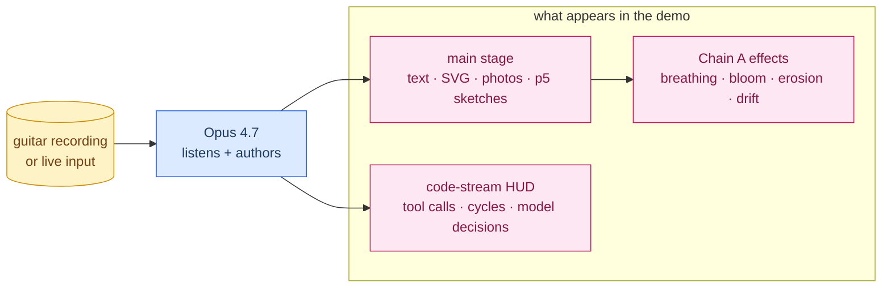
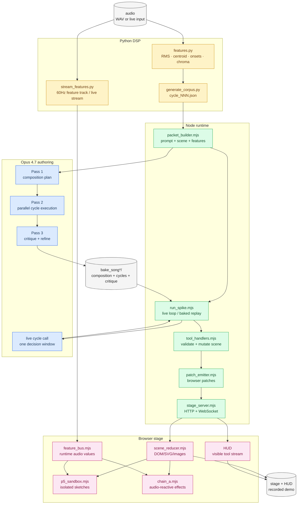

<div align="center">

# The Feed Looks Back

***A live audiovisual performance system where Claude Opus 4.7 listens once per musical phrase and authors the visuals on stage — earnest, attentive, almost right.***

[](https://www.anthropic.com/) [](#setup) [](#two-temporal-modes) [](docs/SUBMISSION.md)

<sub>Built for the **Build with Opus 4.7** hackathon · April 2026 · Submission target: *Most Creative Opus 4.7 Exploration* + *Keep Thinking*</sub>

</div>

> *Cover image goes here once generated — paste the prompt from [`docs/ASSET_PROMPTS.md`](docs/ASSET_PROMPTS.md) into ChatGPT (or any image generator) and drop the result at `assets/cover/cover.png`.*

---

## What it is

A musician plays in a tradition a general-purpose model wasn't optimised for. Claude Opus 4.7 listens once per musical phrase, reads the moment, and authors the visuals on stage — text that fades in, photographic references that arrive, p5 sketches and SVG fragments, every element subtly bound to the music. Earnest, attentive, almost right. The gap between what the music is and what the screen returns is the piece.

## Visual overview

In the demo, the audience sees a performance surface rather than a developer
tool. The music drives the timing; Opus authors the scene; the HUD makes the
authorship legible.



| Surface | What it shows | Why it matters |
|---|---|---|
| Stage | The accumulated composition: text fragments, photographic anchors, SVG forms, p5 sketches, fades, palette shifts, transforms | The artwork itself |
| HUD | Cycle-by-cycle Opus tool calls and model-authored decisions | Proof that Opus is authoring, not decorating a preset visualizer |
| Chain A | Local 60fps motion tied to audio features and structural events | Keeps the scene alive between model calls |
| Bake replay | A deterministic performance of Opus's offline composition score | Makes the final video clean while preserving model authorship |

## Quick links

| 🚀 Run it | 📖 Read it | 📤 Submit it |
|---|---|---|
| [Setup](#setup) · [Live / API run](#live--api-run) · [Bake mode](#bake-mode) · [Validation](#validation) | [Visual overview](#visual-overview) · [Two temporal modes](#two-temporal-modes) · [End-to-end architecture](#end-to-end-architecture) · [Repository map](#repository-map) · [Documentation map](#documentation-map) | [Submission notes](#submission-notes) · [`docs/SUBMISSION.md`](docs/SUBMISSION.md) · [`docs/PROJECT_DESCRIPTION.md`](docs/PROJECT_DESCRIPTION.md) · [`docs/FINAL_DEEP_DIVE_CHECK_2026_04_25.md`](docs/FINAL_DEEP_DIVE_CHECK_2026_04_25.md) |

For the visual map of how everything connects, see [`docs/ARCHITECTURE.md`](docs/ARCHITECTURE.md). For the curated entry into the full doc set, see [`docs/INDEX.md`](docs/INDEX.md).

## Two temporal modes

The submission branch supports two complementary paths:

- **Live / API mode:** Opus authors the scene cycle by cycle while the stage,
  HUD, and optional audio playback run in the browser. The improvising
  stance.
- **Bake mode:** Opus runs three offline passes over the whole track — a
  composition pass that reads the work as multi-modal input and writes a
  per-cycle intent score, a parallel execution pass under that plan, and a
  critique-and-refine pass where Opus reviews and rewrites its own weak
  cycles. The browser then replays the refined score deterministically in
  sync with audio. The composing stance.

Same prompts, same tools, different relationship to time.

## End-to-end architecture



The full system map — per-cycle sequence, three-pass bake pipeline, browser
stage components, and project evolution timeline — lives in
[`docs/ARCHITECTURE.md`](docs/ARCHITECTURE.md).

## A note on naming

The current artistic prompt is **Bayati**. Some runtime feature names still
use the older `hijaz_*` contract because they sit on an internal interface
between the DSP layer, the detector, the patch protocol, and the browser
bindings. The prompt (`node/prompts/bayati_base.md`) and Chain A effects
layer remap those signals into Bayati semantics. `hijaz_base.md` is kept
in-tree for diff-style inspection of the older register and is not loaded
at runtime.

## Repository Map

| Path | Purpose |
|---|---|
| `python/` | Offline DSP, corpus generation, feature-track precompute, track enrichment |
| `node/src/` | Opus runner, packet builder, stage server, bake-mode passes, validation helpers |
| `node/browser/` | Browser stage, HUD, p5 sandbox, feature bus, Chain A effects layer |
| `node/prompts/` | Bayati/Hijaz system prompts, tool schemas, bake-pass prompts |
| `node/canon/` | Mood-board metadata, placeholders, reference photos |
| `corpus_song1/`, `corpus_song5/` | Per-cycle DSP JSON for the two current submission tracks |
| `bake_song1/`, `bake_song5/` | Baked composition plans, cycle outputs, critique outputs, track metadata |
| `docs/` | Handoffs, design plans, submission status, and final audit notes |
| `assets/` | Visual assets — logo, cover, thumbnail, social, backgrounds (see [`assets/README.md`](assets/README.md)) |

## Documentation map

| Doc | Audience | Purpose |
|---|---|---|
| [`README.md`](README.md) — you are here | reproducer, contributor | Setup, commands, validation |
| [`docs/INDEX.md`](docs/INDEX.md) | judge, reproducer | Curated entry into the full doc set |
| [`docs/PROJECT_DESCRIPTION.md`](docs/PROJECT_DESCRIPTION.md) | judge | Public-safe one-pager |
| [`docs/ARCHITECTURE.md`](docs/ARCHITECTURE.md) | judge, contributor | System diagrams, dataflow, evolution timeline |
| [`docs/SUBMISSION.md`](docs/SUBMISSION.md) | reproducer | Submission runbook with rubric alignment |
| [`docs/ASSET_PROMPTS.md`](docs/ASSET_PROMPTS.md) | maintainer | ChatGPT prompts for cover, logo, thumbnail, social, backgrounds |
| [`docs/FINAL_DEEP_DIVE_CHECK_2026_04_25.md`](docs/FINAL_DEEP_DIVE_CHECK_2026_04_25.md) | maintainer | Final audit, Code Review Graph findings, residual risks |
| [`assets/README.md`](assets/README.md) | maintainer | Assets directory layout and naming conventions |

## Setup

Python uses the local conda env expected by the scripts:

```bash
/home/amay/miniconda3/envs/ambi_audio/bin/python --version
```

For commands that spawn subprocesses or touch Matplotlib/Numba caches inside a
sandbox, use writable cache dirs:

```bash
export PATH=/home/amay/miniconda3/envs/ambi_audio/bin:$PATH
export MPLCONFIGDIR=/tmp/mplconfig
export NUMBA_CACHE_DIR=/tmp/numba-cache
```

Node setup:

```bash
cd node
pnpm install
cp .env.example .env
# add ANTHROPIC_API_KEY for real Opus calls
```

## Generate A Corpus

```bash
python python/generate_corpus.py "audio/song 1.wav" corpus_song1
python python/generate_corpus.py "audio/song 1.wav" --print-example
```

The first cycle summarizes audio from 1.0s to 5.0s. The initial 0.0s-1.0s is
intentionally skipped so all later windows align to whole 5-second boundaries.

## Live / API Run

```bash
cd node
node src/run_spike.mjs ../corpus_song1 --config config_a --dry-run
node src/run_spike.mjs ../corpus_song1 --config config_a --stage-audio "../audio/song 1.wav"
```

The runner prints:

- combined stage + HUD URL
- stage-only URL
- live monitor HTML path
- final scene HTML path
- `run_summary.json` with timing, cost, patches, and tool-call counts

Use `--cycles N:M` for a subset and `--feature-producer none` when you do not
want live Python feature streaming.

## Bake Mode

Run the three Opus bake passes:

```bash
cd node

node src/bake_composition.mjs \
  --corpus ../corpus_song1 \
  --audio "../audio/song 1.wav" \
  --bake-dir ../bake_song1

node src/bake_cycles.mjs \
  --bake-dir ../bake_song1 \
  --corpus ../corpus_song1 \
  --concurrency 5 \
  --resume

node src/bake_critique.mjs \
  --bake-dir ../bake_song1 \
  --max-refines 6
```

Replay a baked bundle:

```bash
cd node
node src/run_spike.mjs --use-baked ../bake_song1 --stage-audio "../audio/song 1.wav"
```

For watch-only playback with an open browser window:

```bash
cd node
node src/bake_watch.mjs --use-baked ../bake_song1 --stage-audio "../audio/song 1.wav"
```

Generate submission helper artifacts:

```bash
cd node
node src/bake_render_plan.mjs ../bake_song1
node src/bake_highlight_rationales.mjs --bake-dir ../bake_song1 --top 5
```

## Validation

Core checks used for the 2026-04-25 final pass:

```bash
node node/src/run_spike.mjs --self-test
node node/src/stage_server.mjs
node node/browser/scene_reducer.mjs
node node/src/bake_io.mjs
node node/src/bake_anthropic.mjs
node node/src/bake_composition.mjs --self-test
node node/src/bake_cycles.mjs --self-test
node node/src/bake_critique.mjs --self-test
node node/src/bake_player.mjs --self-test
node node/src/video_capture.mjs --self-test
node node/src/bake_render_plan.mjs --self-test
node node/src/bake_highlight_rationales.mjs --self-test
```

Python checks:

```bash
PATH=/home/amay/miniconda3/envs/ambi_audio/bin:$PATH \
MPLCONFIGDIR=/tmp/mplconfig \
NUMBA_CACHE_DIR=/tmp/numba-cache \
/home/amay/miniconda3/envs/ambi_audio/bin/python -m unittest python.tests.test_enrich_track

PATH=/home/amay/miniconda3/envs/ambi_audio/bin:$PATH \
MPLCONFIGDIR=/tmp/mplconfig \
NUMBA_CACHE_DIR=/tmp/numba-cache \
/home/amay/miniconda3/envs/ambi_audio/bin/python python/stream_features.py --self-test
```

`stage_server.mjs` and `self_frame.mjs` bind temporary localhost servers. In
restricted sandboxes, run those from a normal shell or allow localhost binding.

## Submission Notes

- Current branch: `test/integration-all-four`.
- Current baked tracks: `bake_song1` (27 cycles) and `bake_song5` (30 cycles).
- `video_capture.mjs` gracefully falls back to manual screen recording when
  Playwright or `ffmpeg` is unavailable.
- See `docs/SUBMISSION.md` for the concise submission runbook.
- See `docs/FINAL_DEEP_DIVE_CHECK_2026_04_25.md` for the final audit, Code
  Review Graph findings, validation results, and residual risks.

## License

The original project code and documentation are available under the
[MIT License](LICENSE).

Bundled third-party code and media keep their own terms:

- `node/vendor/p5/p5.min.js` is p5.js 2.2.3 under LGPL-2.1; see
  `node/vendor/p5/LICENSE` and `node/vendor/p5/README.md`.
- Public reference photos are documented in
  `node/canon/reference_photos/ATTRIBUTION.md`.
- Additional licensing notes are collected in [NOTICE](NOTICE).
