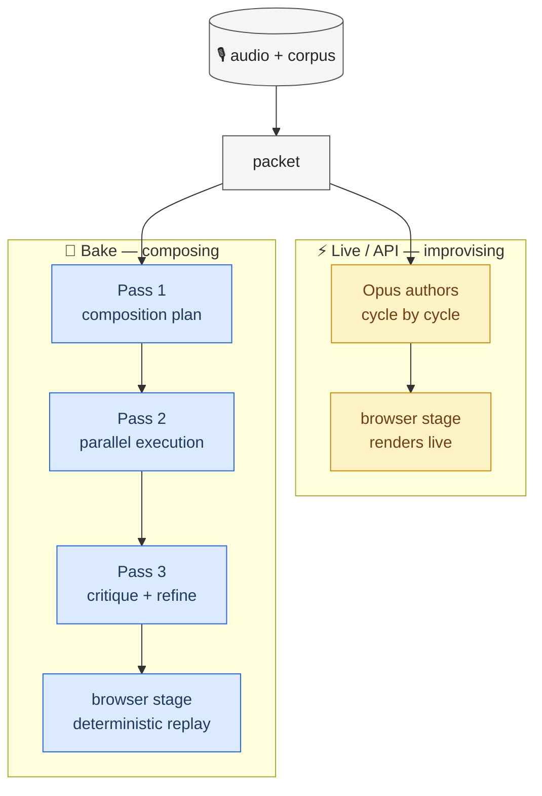
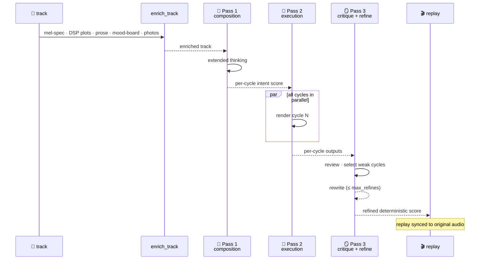
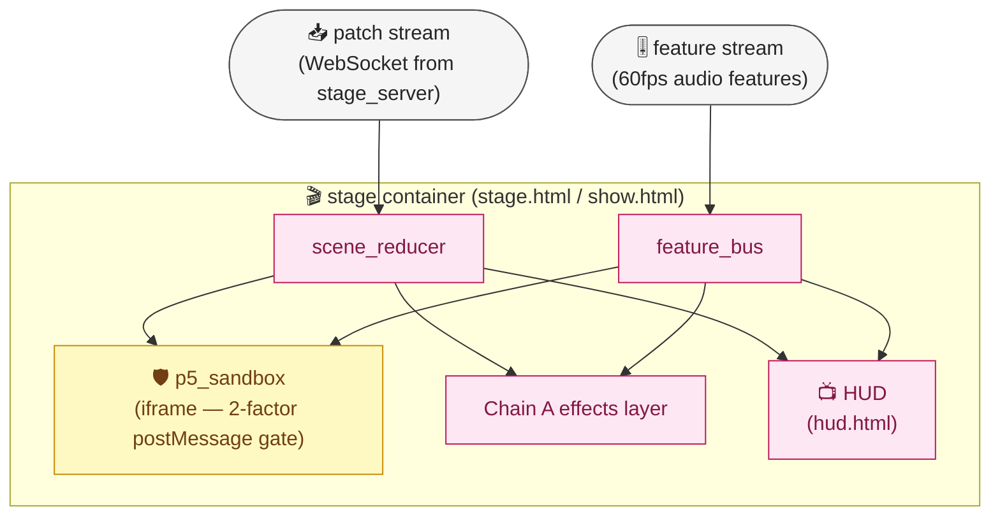
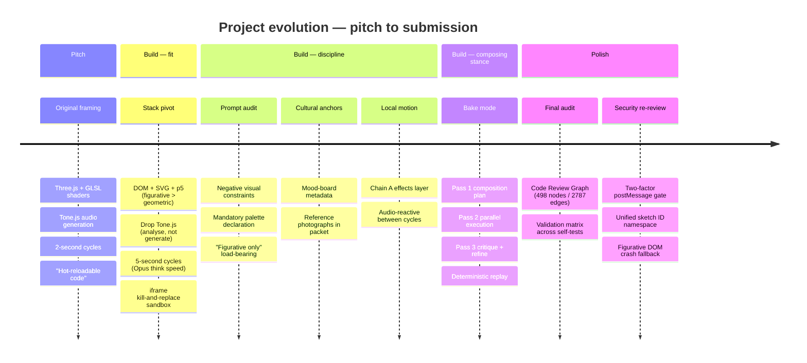

# Architecture & Evolution

A visual map of how *The Feed Looks Back* works under the hood — the live cycle, the two temporal stances, the bake pipeline, the browser stage, and how the project arrived here.

Pair this document with:

- [`README.md`](../README.md) — setup, commands, validation
- [`PROJECT_DESCRIPTION.md`](PROJECT_DESCRIPTION.md) — public-safe one-pager
- [`SUBMISSION.md`](SUBMISSION.md) — submission runbook
- [`INDEX.md`](INDEX.md) — full doc map

---

## 🏛️ System overview

Audio enters a Python DSP layer that turns it into a structured per-cycle corpus. The Node runtime assembles that corpus into a packet, asks Opus 4.7 to author the next visual gesture, and the resulting tool calls flow through a patch protocol into a browser stage. A HUD mirrors the model's authorship as it happens.

```mermaid
flowchart LR
    accTitle: System overview — four layers from audio to stage
    accDescr: Audio is processed by a Python DSP layer into a per-cycle corpus, packaged into a structured packet by the Node runtime, sent to Opus 4.7 which returns tool calls, dispatched through a patch protocol to a browser stage, and mirrored in a HUD that shows the model's authorship live.

    audio[("🎙️ audio")]
    opus[("🧠 Opus 4.7 API")]

    subgraph py [" 🐍 Python DSP "]
        direction TB
        windowing[windowing.py]
        features[features.py]
        enrich[enrich_track.py]
        stream[stream_features.py]
        corpus[("corpus_*<br/>per-cycle JSON")]
    end

    subgraph nd [" 🟢 Node runtime "]
        direction TB
        packet[packet_builder]
        runner[run_spike]
        tools[tool_handlers]
        patch[patch_protocol]
        stage_srv[stage_server]
    end

    subgraph br [" 🌐 Browser stage "]
        direction TB
        reducer[scene_reducer]
        hud[HUD]
        sandbox[p5_sandbox]
        chain[Chain A]
        bus[feature_bus]
    end

    audio --> windowing --> features --> corpus
    enrich --> corpus
    stream --> bus
    corpus --> packet --> runner
    runner --> opus
    opus --> runner
    runner --> tools --> patch --> stage_srv --> reducer
    reducer --> sandbox
    reducer --> hud
    reducer --> chain
    bus --> chain
    bus --> sandbox

    classDef io fill:#f5f5f5,stroke:#525252,color:#262626
    classDef pyc fill:#fef3c7,stroke:#ca8a04,color:#713f12
    classDef ndc fill:#dcfce7,stroke:#16a34a,color:#14532d
    classDef brc fill:#fce7f3,stroke:#be185d,color:#831843
    classDef opc fill:#dbeafe,stroke:#2563eb,color:#1e3a5f

    class audio io
    class opus opc
    class windowing,features,enrich,stream,corpus pyc
    class packet,runner,tools,patch,stage_srv ndc
    class reducer,hud,sandbox,chain,bus brc
```



> **Read the diagram:** four colour-coded zones — Python DSP (warm), Node runtime (green), Opus API (blue), browser stage (pink). Audio flows left to right; the only round-trip is the Opus call, where the runner sends a packet and receives tool calls back.

---

## 🎼 Two temporal stances

Same prompts, same tools, different relationship to time. The architecture forks at the packet stage: in **Live** mode, Opus authors one cycle at a time during performance; in **Bake** mode, three offline passes produce a deterministic score that the browser stage replays in sync with the original audio.



> **Read the diagram:** the same packet feeds two paths. The warm path (Live) is one model call, one stage update — repeated every ~5s. The cool path (Bake) is three offline passes with extended thinking, then a deterministic replay.

---

## ⏱️ Per-cycle live loop

Every ~5 seconds during a live run, the system completes one full cycle: a window of audio becomes features, features become a packet, the packet becomes a model call, the model's tool calls become patches, the patches become DOM/SVG/p5 ops on the stage. The HUD streams the same tool calls so a viewer sees the model's authorship as it happens.

```mermaid
sequenceDiagram
    accTitle: Per-cycle live loop — audio to stage in one cycle
    accDescr: A 5-second audio window becomes DSP features, the features become a packet, the packet drives one Opus call, Opus returns tool calls, the tool calls become patches that update the browser stage, and the HUD mirrors the same tool stream so the viewer sees the model authoring in real time. The cycle repeats.

    participant Aud as 🎙️ Audio
    participant DSP as 🐍 DSP
    participant Pkt as 📦 packet
    participant Opus as 🧠 Opus 4.7
    participant Tools as tool_handlers
    participant Stage as 🌐 stage
    participant HUD as 📺 HUD

    Aud->>DSP: 5-second window
    DSP->>Pkt: features (loudness · onset · spectral · pitch · silence · structural)
    Note over Pkt: + scene state, recent decisions, mood-board, photos
    Pkt->>Opus: prompt + DSP + scene + cultural briefing
    Opus-->>Tools: tool calls (addText · addImage · addP5Sketch · transformElement · …)
    Tools->>Stage: patch ops (place · transform · fade)
    Stage-->>HUD: mirror tool stream
    Note over Stage,HUD: scene evolves; ~5s later, repeat
```

> **Read the diagram:** the only synchronous boundary is the Opus call. Everything else streams. The HUD is a passive mirror of the same tool stream the stage applies.

---

## 🍞 Three-pass bake pipeline

In bake mode, the same model that performs live becomes a composer. Pass 1 reads the whole track multi-modally and writes a per-cycle intent score under a generous extended-thinking budget. Pass 2 generates each cycle in parallel under that plan. Pass 3 reviews its own output and rewrites the cycles it judges weak. The refined score replays deterministically against the original audio.



> **Read the diagram:** Pass 1 is the composer's read-through. Pass 2 is parallel-throughput drafting under the plan. Pass 3 is the model auditing itself, rewriting only the cycles it judges weak. Replay is deterministic — given the same baked bundle, the same visuals appear at the same audio timestamps.

---

## 🎨 Browser stage components

The browser stage is the surface where Opus's authorship lands. A scene reducer holds the DOM truth; a HUD mirrors the patch stream so viewers see what the model is choosing; a sandboxed iframe hosts p5 sketches behind a two-factor postMessage gate; a Chain A effects layer keeps elements breathing between cycles via local audio reactivity; a feature bus distributes 60-fps audio features to anyone who wants them.



> **Read the diagram:** the sandbox is the only sensitive boundary (yellow) — every postMessage in/out is gated by both origin and source. Everything else is a passive consumer of two streams: patches from the runtime and features from the audio analyser.

---

## 🌱 How the project evolved

The project moved from a reactive prototype with three.js and GLSL shaders to a figurative DOM/SVG/p5 stage with prompt audits, reference imagery, local motion effects, and an offline composing pipeline. The deeper shift was conceptual: Opus came to be used in two complementary temporal stances rather than only as a real-time performer.



> **Read the diagram:** the conceptual shift sits in the third "Build" section. The features after that point — bake mode, deterministic replay — are downstream of the realisation that Opus is strongest as a composer-and-self-editor when given the time to be one.

---

## 🗺️ Source map

| Layer | Path | Role |
|---|---|---|
| Python DSP | `python/features.py` | Audio feature extraction (loudness, onset, spectral, pitch-class, silence, structural) |
| Python DSP | `python/windowing.py` | 5-second corpus windowing aligned to whole-second boundaries |
| Python DSP | `python/enrich_track.py` | Track-level enrichment for bake (mel-spectrogram, DSP plots, prose corpus) |
| Python DSP | `python/generate_corpus.py` | Per-cycle corpus generation entry point |
| Python DSP | `python/stream_features.py` | 60-fps live feature stream to the browser feature_bus |
| Node runtime | `node/src/run_spike.mjs` | Live cycle runner (also dispatches `--use-baked` replay) |
| Node runtime | `node/src/packet_builder.mjs` | Opus packet assembler (DSP + scene + decisions + briefing + photos) |
| Node runtime | `node/src/opus_client.mjs` | Anthropic SDK wrapper |
| Node runtime | `node/src/tool_handlers.mjs` | Tool-call dispatch into the patch protocol |
| Node runtime | `node/src/patch_protocol.mjs` + `patch_emitter.mjs` | Stage patch ops + browser-safe emitter |
| Node runtime | `node/src/stage_server.mjs` | WebSocket bridge to the browser stage |
| Bake pipeline | `node/src/bake_composition.mjs` | Pass 1 — composition plan |
| Bake pipeline | `node/src/bake_cycles.mjs` | Pass 2 — parallel execution |
| Bake pipeline | `node/src/bake_critique.mjs` | Pass 3 — critique + refine |
| Bake pipeline | `node/src/bake_player.mjs` | Deterministic replay against original audio |
| Bake pipeline | `node/src/bake_render_plan.mjs` | Submission helper — rendered composition plan |
| Bake pipeline | `node/src/bake_highlight_rationales.mjs` | Submission helper — top rationales picker |
| Browser stage | `node/browser/scene_reducer.mjs` | Source of truth for DOM scene state |
| Browser stage | `node/browser/hud.mjs` | HUD that mirrors Opus authorship |
| Browser stage | `node/browser/p5_sandbox.mjs` | Iframe-isolated p5 host with two-factor postMessage gate |
| Browser stage | `node/browser/chain_a.mjs` | Local audio-reactive motion effects |
| Browser stage | `node/browser/feature_bus.mjs` | 60-fps feature distribution |
| Prompts | `node/prompts/bayati_base.md` | Active artistic prompt (the figurative-only contract) |
| Prompts | `node/prompts/hijaz_base.md` | Retained for diff inspection of the older register |
| Prompts | `node/prompts/bake/` | Bake-pass prompt templates |

---

## 🔗 See also

- The figurative-only aesthetic contract is enforced inside `node/prompts/bayati_base.md` (`### Figurative only — this is load-bearing`).
- The mandatory palette constants are declared at `node/prompts/bayati_base.md` (`### Mandatory palette — declare these constants in every sketch`).
- The two-factor postMessage gate on the p5 sandbox lives in `node/browser/p5_sandbox.mjs`.
- The Chain A motion-effects layer lives in `node/browser/chain_a.mjs`.
- The bake-pass templates live under `node/prompts/bake/`.
- For the final audit results (validation matrix, Code Review Graph findings, residual risks) see [`FINAL_DEEP_DIVE_CHECK_2026_04_25.md`](FINAL_DEEP_DIVE_CHECK_2026_04_25.md).
